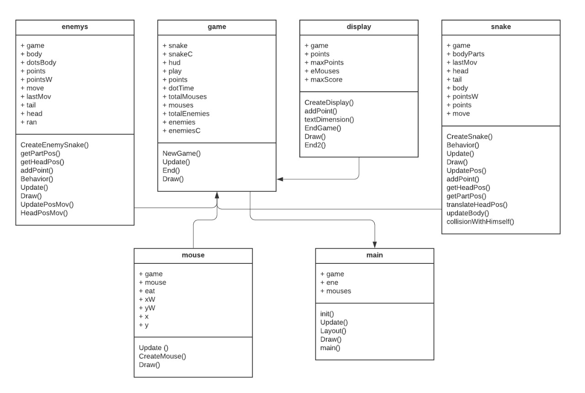

# Snake Game

Classic game developed and published in 1976
Single-player
In the game's start is configure the number of food dots and the number of enemy snakes
Food dots randomly located 
Enemy snakes will move random way
Main snake grow one unit on every eaten food dot, and the enemy snakes too when they touch food dots
Main snake loses when it has been hit 10 times by other snake or it touches the limits
Main snake win the game when eats all food dots and has the largest length

## Architecture

**Programming language: Go**

Open source programming language
static typing and run-time efficiency like C
readability and usability like Python or JavaScript
high-performance networking and multiprocessing

**Ebiten library**

Open source game library
Quickly and easily develop 2D games
Everything is an imagej
Multiplatform
High performance
Production-read

Ebiten library's methods implementation:
* **Draw**: Method to render the images in every frame. 
* **Update**: This method for the game logic.
* **Layout**: Method that defines the overall game layout.

### Game Structure
Project files: 

* root 
    * assets/
    * files/
    * main.go
    * main.exe
    * go.mod
    * go.sum

The main needed these files for the game:
* Display
* Game
* Mouse
* Enemys
* Snake

In the image below you can see all entities and methods in detail

## Requirements

* The game's layout can be static.
* Food dots can be randomly located in the layout.
* Number of food dots must be configured in the game's tart.
* The main snake gamer must be controlled by the user.
* Enemy snakes are autonomous entities that will move a random way.
* Enemy snakes and main snake should respect the layout limits and walls.
* Enemy snakes number can be configured on game's start.
* Each enemy's behaviour will be implemented as a separate thread.
* Enemy snakes and main sneak threads must use the same map or game layout data structure resource.
* Display obtained main snake's scores.
* Main snake grow one unit on every eaten food dot.
* Enemy snakes can also grow when they touch food dots.
* Main snake loses when it has been hit 10 times by other snake or it touches the limits or walls.
* Main snake wins the game when all food dots have eaten and main snake has the largest length.

